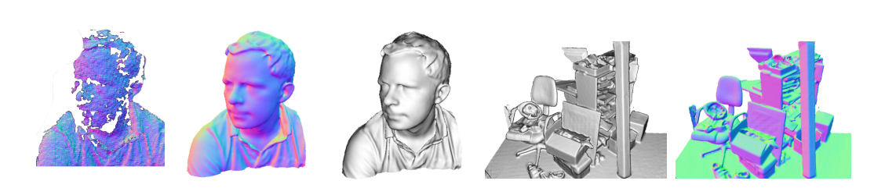

# KinectFusion

This repository is a re-implementation of KinectFusion paper, which is a part of group project for 3D Scanning and Motion Capture at TUM
KinectFusion paper: https://www.microsoft.com/en-us/research/wp-content/uploads/2016/02/ismar2011.pdf


## Download Datasets

```
sh data/download_tumrgbd.sh
```

You can add dataset links into ```data/rgbd_tum_datasets.txt```. (maybe you can refer the list of ```data/rgbd_tum_datsets_2011.txt```)

## Set Parameters

Make yaml file to set parameters.
You can copy ```data/template.yaml```.
